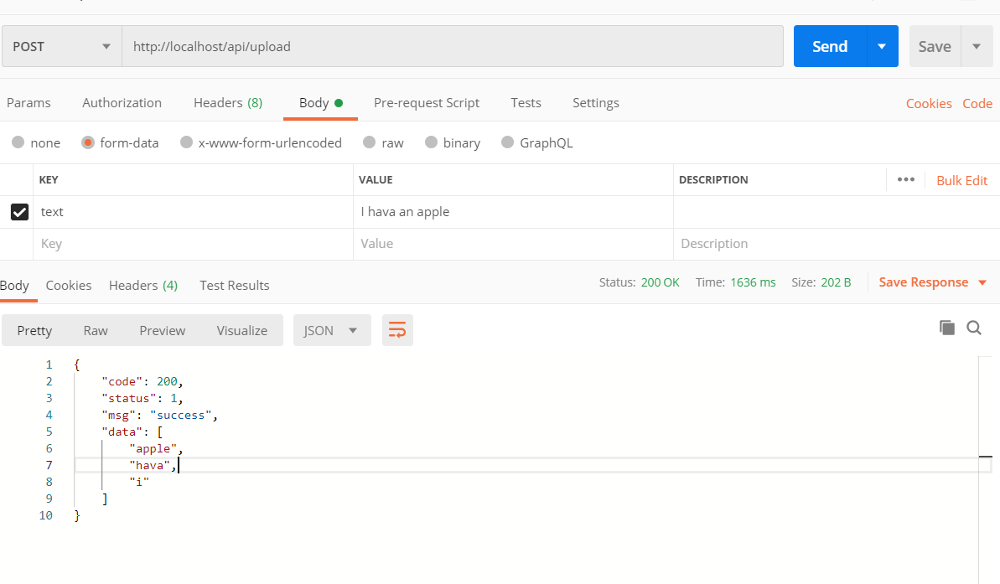

# API接口

使用浏览器访问采用http://39.102.62.210/ 的方式进行

安卓访问应该设计HttpUrlConnection类的有关操作

## 通用返回值格式

```json
{
    "code" :"200为成功，其他均为失败",
    "status" : "0 or 1; 1为操作正常完成，0为服务器正常返回，但要求的操作没有完成，例如没有查到数据",
    "msg":"成功或者失败的信息",
    "data":"数据"
}

```

## 单词查询

### getoneword

#### request

+ Method:**GET**

+ URL:```/api/getoneword```

+ 参数：

  + keyword：表示要求查询的单词
  + top：返回结果的数目，默认值为1

+ 实例

  ```url
  39.102.62.210/api/getoneword?keyword=apple
  ```

#### response

```json
{
    "code": 200,
    "status": 1,
    "msg": "success",
    "data": [
        {
            "id": 42432,
            "word": "apple",
            "sw": null,
            "phonetic": "'æpl",
            "definition": "n. fruit with red or yellow or green skin and sweet to tart crisp whitish flesh\\nn. native Eurasian tree widely cultivated in many varieties for its firm rounded edible fruits",
            "translation": "n. 苹果, 家伙\\n[医] 苹果",
            "pos": "",
            "collins": true,
            "oxford": true,
            "tag": "zk gk",
            "bnc": 2446,
            "frq": 2695,
            "exchange": "s:apples",
            "detail": "",
            "audio": ""
        }
    ]
}
```

## 上传单词

### upload

#### request

+ Method：Post

+ URL：/api/upload

+ 参数：Post参数体中text，能接受表单数据的输入，可以看一下能不能用表单的方式上传，不能再说

  实例

  

### response

```json
{
    "code": 200,
    "status": 1,
    "msg": "success",
    "data": [
        "i",
        "flower",
        "sky"
    ]
}
//这里会把成功加入计划的单词如数返回，但只会返回单词
```

## 计划相关

### list 

### request

列出目前计划内的全部单词

+ Method：Get
+ URL：/api/list
+ 参数：无
+ 实例： 39.102.62.210/api/getoneword?keyword=apple

### response

```json
{
    "code": 200,
    "status": 1,
    "msg": "success",
    "data": [
        {
            "id": 7,
            "word": "I",
            "uid": 1,
            "wid": 340218,
            "joined_time": "2020-05-08T05:02:07.000+0000",
            "last_update": "2020-05-08T05:02:07.000+0000",
            "stage": 0,
            "errors": 0,
            "recite_times": 0
        },
        {
            "id": 8,
            "word": "flower",
            "uid": 1,
            "wid": 266932,
            "joined_time": "2020-05-08T05:02:07.000+0000",
            "last_update": "2020-05-08T05:02:07.000+0000",
            "stage": 0,
            "errors": 0,
            "recite_times": 0
        }
    ]
}
```

### getonetask 

### request

获得用于背诵的num个单词

+ Method：Get
+ URL：/api/getonetask
+ 参数：num
+ 实例： 39.102.62.210/api/getonetask?num=20

### recite 

### request

根据背诵情况修改数据,opetator = 0表示不认识，operator = 1表示认识

+ Method：Post
+ URL：/api/recite
+ 参数：operator, word
+ 实例： 39.102.62.210/api/recite?operator=1&word=apple

### delete_word_in_plan

#### request

+ method:Delete
+ URL：/api/delete_word_in_plan
+ 参数：word
+ 实例：39.102.62.210/api/delete_word_in_plan?word=apple

#### response

```json
{

  "code": 200,

  "status": 1,

  "msg": "success",

  "data": "success"

}
```


## 用户管理

这一部分现在是最naive的方式，实现方法大概就是查数据库里的一张用户表，没啥意思，看看啥时候迅速的改一改

### signUp

注册

+ Method：Post

+ URL：/api/signUp
+ param
  + username
  + password

#### response

```json
{
    "code": 200,
    "status": 0,
    "msg": "用户名已存在",
    "data": null
}
```

成功时status为1，返回数据为sign up success

### signIn

注册

+ Method：Post

+ URL：/api/signIn
+ param
  + username
  + password

#### response

```json
{
    "code": 200,
    "status": 1,
    "msg": "success",
    "data": "登录成功"
}
```


## 返回简单数据

这一部分仅供测试，不遵循上文提到的数据格式

### hello

目前只能简单的返回hello world数据

#### request

- Method：**GET**
- URL：```/```

+ Headers: none
+ Body: none

#### response

```
hello world!
```

## 数据库相关操作

目前可以展示整张student表的内容、添加学生以及更改学生的名字

### query

+ Method： **GET** 
+ URL：```/student/query```
+ Headers:none
+ Body:none

#### response

```
[]
```

### add

添加一名叫junjun的学生，年龄为6

#### request

+ Method：**GET**
+ URL：/student/add
+ Header:none
+ Body:none

#### response

```
无
```

### update

将junjun的名字改成duoduo

#### request

+ Method：**GET**
+ URL：/student/update
+ Header:none
+ Body:none

#### response

```
无
```

